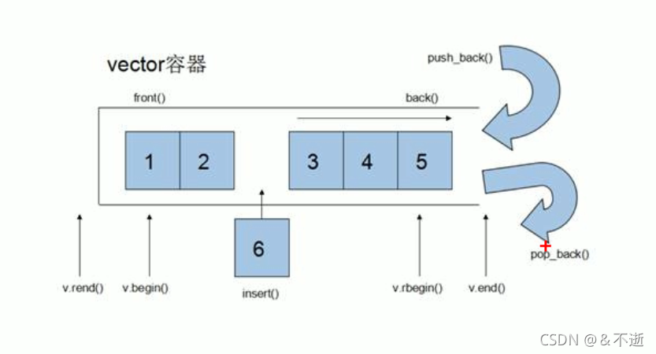

# vector 容器

## 1.1 基本概念

**功能：**vector 数据结构和数组非常相似，也称为单端数组

**vector与普通数组的区别：**数组是静态空间，vector可以动态扩展

**动态扩展：**动态扩展并不是在原有的空间之后续接新空间，而是找更大的内存空间，然后将原数据拷贝到新空间，释放原空间



## 1.2 构造函数

构造函数原型

```cpp
vector<T> v ; //使用模板类，默认构造函数
vector(v.begin(),v.end()); //将[v.begin(),v.end())区间中的元素拷贝给本身
vextor(n,elem); //将n个elem拷贝给本身
vector(const vector &v) ; //拷贝构造函数
```

```cpp
#include<iostream>
using namespace std;
#include <vector>
#include <algorithm> // 标准算法头文件

// vector 容器

void printVector(vector<int> &v)
{
	for(vector<int>::iterator it = v.begin(); it!=v.end(); it++)
	{
		cout<< *it << "";
	}
	cout << endl;
}

void test01()
{
    vector<int> v1; // 默认构造，无参构造
	for(int i=0; i<10; i++)
	{
		v1.push_back(i);
	}
	printVector(v1);

	// 通过区间的方式进行构造
	vector<int> v2(v1.begin(), v1.end());
	printVector(v2);

	// n 个 elem 方式构造
	vector<int> v3(10, 100); // 10 个 100
	printVector(v3);

	// 拷贝构造
	vector<int> v4(v3);
	printVector(v4);
	
}

int main()
{
    test01();
}
```

## 1.3 赋值操作

函数原型：

```cpp
vector& operator=(const vector &v); //重载赋值运算符
assign(v.begin(),v.end()); //将[v.begin(),v.end())区间中的元素赋值给本身
assign(n,elem); //将n个elem赋值给本身
```

```cpp
#include<iostream>
using namespace std;
#include <vector>
#include <algorithm> // 标准算法头文件

// vector 容器

void printVector(vector<int> &v)
{
	for(vector<int>::iterator it = v.begin(); it!=v.end(); it++)
	{
		cout<< *it << " ";
	}
	cout << endl;
}

void test01()
{
    vector<int> v1;
	for(int i=0; i<10; i++)
	{
		v1.push_back(i);
	}
	printVector(v1);

	// 赋值
	vector<int> v2;
	v2 = v1;
	printVector(v2);

	vector<int> v3;
	v3.assign(v1.begin(), v1.end()); // assign 的赋值区间是左闭右开
	printVector(v3);

	vector<int> v4;
	v4.assign(10, 100); //  10 个 100
	printVector(v4);

}


int main()
{
    test01();
}
```

## 1.4 容量与大小

函数原型

```cpp
empty(); //判断容器是否为空，为空返回1，否则返回0
capacity(); //返回容器的容量
size(); //返回容器的大小,即容器中元素的个数
resize(int num); //重新指定容器的长度为num，若容器变长，则以默认值0填充新位置,如果容器变短，则末尾超过容器长度的元素被删除
resize(int num,int elem); //重新指定容器的长度为num，若容器变长，则以elem填充新位置,如果容器变短，则末尾超过容器长度的元素被删除
resize特性:长赋值，短截断
```

```cpp
#include<iostream>
using namespace std;
#include <vector>
#include <algorithm> // 标准算法头文件

// vector 容器

void printVector(vector<int> &v)
{
	for(vector<int>::iterator it = v.begin(); it!=v.end(); it++)
	{
		cout<< *it << " ";
	}
	cout << endl;
}

void test01()
{
    vector<int> v1;
	for(int i=0; i<10; i++)
	{
		v1.push_back(i);
	}
	printVector(v1);

	// 容量与大小
	if(v1.empty())
	{
		cout << "v1 为空" << endl;
	}
	else
	{
		cout << "v1 不为空" << endl;
		cout << "v1的容量是" << v1.capacity() << endl; // capacity()总是大于等于size()
		cout << "v1的大小是" << v1.size() << endl;
	}

	// 重新指定大小
	v1.resize(15); // 如果重新指定的比原来的长了，默认用0来填充新的位置。也可以自己改 v1.resize(15, 100); 用100填充空白位置
	printVector(v1); // 0 1 2 3 4 5 6 7 8 9 0 0 0 0 0

	v1.resize(5); // 如果重新指定的比原来的短了，超出部分会删掉。
	printVector(v1); // 0 1 2 3 4
}

int main()
{
    test01();
}
```

## 1.5 插入和删除

函数原型

```cpp
push_back(ele); //尾部插入元素ele
pop_back(); //删除最后一个元素
insert(const_iterator pos,ele); //在迭代器指向的位置pos处插入一个元素ele
insert(const_iterator pos,int count,ele); //在迭代器指向的位置pos处插入count个元素ele
erase(const_iterator pos); //删除迭代器指向的元素
erase(const_iterator begin,const_iterator end); //删除迭代器从begin到end之间的元素
clear(); //删除容器中所有元素
```

```cpp
#include<iostream>
using namespace std;
#include <vector>
#include <algorithm> // 标准算法头文件

// vector 容器

void printVector(vector<int> &v)
{
	for(vector<int>::iterator it = v.begin(); it!=v.end(); it++)
	{
		cout<< *it << " ";
	}
	cout << endl;
}

void test01()
{
	// 插入和删除
    vector<int> v1;
	v1.push_back(0); // 尾插
	v1.push_back(1);
	v1.push_back(2);
	v1.push_back(3);
	v1.push_back(4);
	v1.push_back(5);
	v1.push_back(7);
	printVector(v1); // 0 1 2 3 4 5 7

	v1.pop_back(); // 尾删
	printVector(v1); // 0 1 2 3 4 5

	v1.insert(v1.begin(), 100); // 第一个参数是迭代器
	printVector(v1); // 100 0 1 2 3 4 5

	v1.insert(v1.begin(), 2, 1000); // 插入2个1000
	printVector(v1); // 1000 1000 100 0 1 2 3 4 5

	v1.erase(v1.begin()); // 参数也是迭代器
	printVector(v1); // 1000 100 0 1 2 3 4 5

	v1.erase(v1.begin(), v1.end()); // 按区间删除
	printVector(v1);

	v1.clear(); // 清空
	printVector(v1);
}

int main()
{
    test01();
}
```

## 1.6 数据存取

函数原型

```cpp
at(int idx); //返回索引idx所指的数据
operator[]; //返回[]内索引所指的数据
front(); //返回容器中第一个元素
back(); //返回容器中最后一个元素
```

```cpp
#include<iostream>
using namespace std;
#include <vector>
#include <algorithm> // 标准算法头文件

// vector 容器


void test01()
{
	vector<int> v1;
	for(int i=0; i<10; i++)
	{
		v1.push_back(i);
	}


	// 利用[]方式访问数组中的元素
	for(int i=0; i<v1.size(); i++)
	{
		cout << v1[i] << " ";
	}
	cout << endl;

	// 利用at方式访问元素
	for(int i=0; i<v1.size(); i++)
	{
		cout << v1.at(i) << " ";
	}
	cout << endl;

	// 获取第一个元素
	cout << "第一个元素" << v1.front() << endl;

	// 获取最后一个元素
	cout << "最后一个元素" << v1.back() << endl;
}


int main()
{
    test01();
}
```

## 1.7 互换容器

函数原型

```cpp
swap(v); //容器v和当前容器互换
```

```cpp
#include<iostream>
using namespace std;
#include <vector>
#include <algorithm> // 标准算法头文件

// vector 容器

void printVector(vector<int> &v)
{
	for(vector<int>::iterator it = v.begin(); it!=v.end(); it++)
	{
		cout<< *it << " ";
	}
	cout << endl;
}

void test01()
{
	vector<int> v1;
	for(int i=0; i<10; i++)
	{
		v1.push_back(i);
	}
	printVector(v1);

	vector<int> v2;
	for(int i=10; i>0; i--)
	{
		v2.push_back(i);
	}
	printVector(v2);

	


	cout << "交换后" << endl;
	v1.swap(v2);
	printVector(v1);
	printVector(v2);

}

// 巧用 swap 可以收缩内存空间
void test02()
{
	vector<int> v;
	for(int i=0; i<100000; i++)
	{
		v.push_back(i);
	}
	cout << "v的容量" << v.capacity() << endl;
	cout << "v的大小" << v.size() << endl;

	v.resize(3);
	cout << "v的容量" << v.capacity() << endl;
	cout << "v的大小" << v.size() << endl;

	// 巧用swap收缩内存
	vector<int>(v).swap(v);
	cout << "v的容量" << v.capacity() << endl;
	cout << "v的大小" << v.size() << endl;

}

int main()
{
    test01();
	test02();
}
```

## 1.8 预留空间

功能：减少vector在动态扩容时的扩展次数
每次使用push_back(v)时，如果容器v的大小要超过v的容量时，系统就会对v进行一次动态扩容，至于扩大多少空间，由系统决定

函数原型:

```cpp
reserve(int len);//容器预留len个元素长度，也就是把容量扩为len，
预留的位置并不初始化，同时也不可访问
```

```cpp
#include<iostream>
using namespace std;
#include <vector>
#include <algorithm> // 标准算法头文件

// vector 容器

void printVector(vector<int> &v)
{
	for(vector<int>::iterator it = v.begin(); it!=v.end(); it++)
	{
		cout<< *it << " ";
	}
	cout << endl;
}

void test01()
{
	vector<int> v1;

	// 利用reserve 预留空间
	v1.reserve(100000);

	int num=0; // 统计内存开辟内存的次数
	int * p = NULL;
	for(int i=0; i<100000; i++)
	{
		v1.push_back(i);
		
		if( p != &v1[0])
		{
			p = &v1[0]; // 首地址变一次，说明内存地址扩展了一次
			num++;
		}
	}
	cout << "num=" << num << endl;
	// 如果不预留空间 num=18;
	// 预留空间后  num = 1;
}

int main()
{
    test01();
}
```

