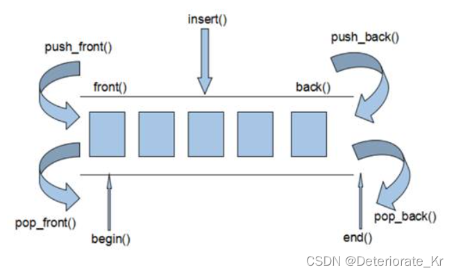
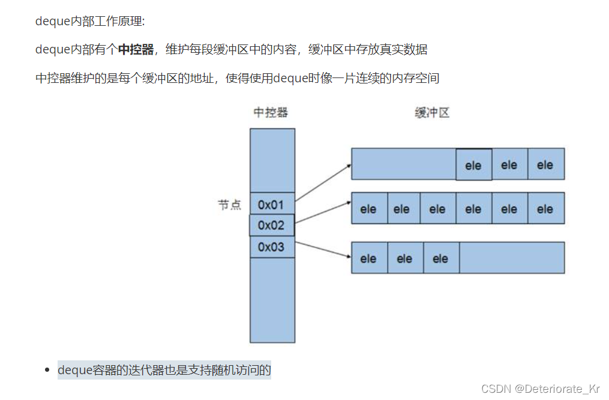

# deque 容器

## 1. 基本概念

**功能：**

- 双端数组，可以对头端进行插入删除操作

**deque与vector区别：**

- vector对于头部的插入删除效率低（因为它需要移动元素），数据量越大，效率越低
- deque相对而言，对头部的插入删除速度回比vector快
- vector访问元素时的速度会比deque快,这和两者内部实现有关





**deque容器中访问数据的时候要通过地址才能访问到缓冲区的数据，所以访问速度比vector容器要慢**

**deque容器的迭代器也是支持跳跃式访问的**

## 2. 构造函数

**函数原型：**

- `deque` deqT; //默认构造形式
- `deque(beg, end);` //构造函数将[beg, end)区间中的元素拷贝给本身。
- `deque(n, elem);` //构造函数将n个elem拷贝给本身。
- `deque(const deque &deq);` //拷贝构造函数

**总结**：deque容器和vector容器的构造方式几乎一致，灵活使用即可

```cpp
#include<iostream>
using namespace std;
#include <deque>
#include <algorithm> // 标准算法头文件

// deque 容器
void printDeque(const deque<int> &d) // 
{
	for(deque<int>::const_iterator it = d.begin(); it != d.end(); it++)
	{
		// *it = 100; 容器加了 const 关键字，不可更改
		cout << *it << " ";
	}
	cout << endl;
}

void test01()
{
	deque<int> d1;
	for(int i=0; i<10; i++)
	{
		d1.push_back(i);
	}
	printDeque(d1);

	deque<int> d2(d1.begin(), d1.end());
	printDeque(d2);

	deque<int> d3(10, 100); // 10 个 100
	printDeque(d3);

	deque<int> d4(d3); //拷贝构造
	printDeque(d4);

}

int main()
{
    test01();
}
```

## 3. 赋值操作

**函数原型：**

- `deque& operator=(const deque &deq); `//重载等号操作符
- `assign(beg, end);` //将[beg, end)区间中的数据拷贝赋值给本身。
- `assign(n, elem);` //将n个elem拷贝赋值给本身

```cpp
#include<iostream>
using namespace std;
#include <deque>
#include <algorithm> // 标准算法头文件

// deque 容器
void printDeque(const deque<int> &d) // 
{
	for(deque<int>::const_iterator it = d.begin(); it != d.end(); it++)
	{
		// *it = 100; 容器加了 const 关键字，不可更改
		cout << *it << " ";
	}
	cout << endl;
}

void test01()
{
	deque<int> d1;
	for(int i=0; i<10; i++)
	{
		d1.push_back(i);
	}
	printDeque(d1);

	// = 赋值
	deque<int> d2 = d1;
	printDeque(d2);

	// assign 赋值
	deque<int> d3;
	d3.assign(d1.begin(), d1.end());
	printDeque(d3);

	// n 个 m
	deque<int> d4;
	d4.assign(10, 100); // 10 个 100
	printDeque(d4);
}

int main()
{
    test01();
}
```

## 4. 大小操作

**函数原型：**

- `deque.empty();` //判断容器是否为空

- `deque.size();` //返回容器中元素的个数

- `deque.resize(num);` //重新指定容器的长度为num,若容器变长，则以默认值填充新位置。如果容器变短，则末尾超出容器长度的元素被删除。

- `deque.resize(num, elem);` //重新指定容器的长度为num,若容器变长，则以elem值填充新位置。如果容器变短，则末尾超出容器长度的元素被删除

```cpp
#include<iostream>
using namespace std;
#include <deque>
#include <algorithm> // 标准算法头文件

// deque 容器
void printDeque(const deque<int> &d) // 
{
	for(deque<int>::const_iterator it = d.begin(); it != d.end(); it++)
	{
		// *it = 100; 容器加了 const 关键字，不可更改
		cout << *it << " ";
	}
	cout << endl;
}

void test01()
{
	deque<int> d1;
	for(int i=0; i<10; i++)
	{
		d1.push_back(i);
	}
	printDeque(d1);

	if(d1.empty())
	{
		cout << "deque 是空的";
	}
	else
	{
		cout << "deque的大小: " << d1.size() << endl;
	}

	// deque 没有容量的概念

	//d1.resize(15); 指定的长度比原来长，默认用为填充 0 1 2 3 4 5 6 7 8 9 0 0 0 0 0
	d1.resize(15, 1); // 也可以手动指定填充的值 0 1 2 3 4 5 6 7 8 9 1 1 1 1 1
	cout << "deque的大小: " << d1.size() << endl;
	printDeque(d1); 

	d1.resize(5); // 指定的长度比原来短， 多出的会被删除 0 1 2 3 4
	printDeque(d1); 
}

int main()
{
    test01();
}
```

## 5. 插入和删除

**1.两端插入操作：**

- `push_back(elem);` //在容器尾部添加一个数据
- `push_front(elem);` //在容器头部插入一个数据
- `pop_back();` //删除容器最后一个数据
- `pop_front();` //删除容器第一个数据

```cpp
#include<iostream>
using namespace std;
#include <deque>
#include <algorithm> // 标准算法头文件

// deque 容器
void printDeque(const deque<int> &d) // 
{
	for(deque<int>::const_iterator it = d.begin(); it != d.end(); it++)
	{
		// *it = 100; 容器加了 const 关键字，不可更改
		cout << *it << " ";
	}
	cout << endl;
}

void test01()
{
	deque<int> d1;

	// 尾插
	d1.push_back(10);
	d1.push_back(20);

	// 头插
	d1.push_front(100);
	d1.push_front(200);

	printDeque(d1); // 200 100 10 20

	// 尾删
	d1.pop_back();
	printDeque(d1); // 200 100 10

	// 头删
	d1.pop_front(); 
	printDeque(d1); // 100 10

}

int main()
{
    test01();
}
```

**2.指定位置操作,注意一定要提供位置，位置就是迭代器。**

- `insert(pos,elem);` //在pos位置前插入一个elem元素的拷贝，返回新数据的位置。
- `insert(pos,n,elem);` //在pos位置前插入n个elem数据，无返回值。
- `insert(pos,beg,end);` //在pos位置插入[beg,end)区间的数据，无返回值。
- `clear();` //清空容器的所有数据
- `erase(beg,end);` //删除[beg,end)区间的数据，返回下一个数据的位置。
- `erase(pos);` //删除pos位置的数据，返回下一个数据的位置。

```cpp
#include<iostream>
using namespace std;
#include <deque>
#include <algorithm> // 标准算法头文件

// deque 容器
void printDeque(const deque<int> &d) // 
{
	for(deque<int>::const_iterator it = d.begin(); it != d.end(); it++)
	{
		// *it = 100; 容器加了 const 关键字，不可更改
		cout << *it << " ";
	}
	cout << endl;
}

void test01()
{
	deque<int> d1;

	// 尾插
	d1.push_back(10);
	d1.push_back(20);

	// 头插
	d1.push_front(100);
	d1.push_front(200);

	printDeque(d1); // 200 100 10 20

	d1.insert(d1.begin(), 1000); 
	d1.insert(d1.begin(), 2, 10000); // 2 个 10000
	printDeque(d1); // 10000 10000 1000 200 100 10 20

	deque<int> d2;
	d2.push_back(1);
	d2.push_back(2);
	d2.push_back(3);

    // 插入一个区间
	d1.insert(d1.begin(), d2.begin(), d2.end());
	printDeque(d1); // 1 2 3 10000 10000 1000 200 100 10 20

	deque<int>:: iterator it = d1.begin();
	it++;
	d1.erase(it);
	printDeque(d1); // 1 3 10000 10000 1000 200 100 10 20

	d1.erase(d1.begin(), d1.end()); // 按区间删除， 从开始到最后，相当于清空
	printDeque(d1); 
	
	d1.clear(); // 清空
	printDeque(d1); 

}

int main()
{
    test01();
}
```

## 6. 数据存取

**函数原型：**

- `at(int idx); `//返回索引idx所指的数据
- `operator[]; `//返回索引idx所指的数据
- `front(); `//返回容器中第一个数据元素
- `back();` //返回容器中最后一个数据元素

```cpp
#include<iostream>
using namespace std;
#include <deque>
#include <algorithm> // 标准算法头文件

void test01()
{
	deque<int> d1;
	for(int i=0; i<10; i++)
	{
		d1.push_back(i);
	}

	// 通过 [] 访问元素
	for(int i=0; i<d1.size(); i++)
	{
		cout << d1[i] << " ";
	}
	cout << endl;

	// 通过 at 方式访问元素
	for(int i=0; i<d1.size(); i++)
	{
		cout << d1.at(i) << " ";
	}
	cout << endl;

	cout << "第一个元素为" << d1.front() << endl;
	cout << "最后一个元素为" << d1.back() << endl;

}

int main()
{
    test01();
}
```

## 7. 排序

**函数原型：**

- `sort(iterator beg, iterator end)` //对beg和end区间内元素进行排序

```cpp
#include<iostream>
using namespace std;
#include <deque>
#include <algorithm> // 标准算法头文件

// deque 容器
void printDeque(const deque<int> &d) // 
{
	for(deque<int>::const_iterator it = d.begin(); it != d.end(); it++)
	{
		// *it = 100; 容器加了 const 关键字，不可更改
		cout << *it << " ";
	}
	cout << endl;
}

void test01()
{
	deque<int> d1;
	d1.push_back(10);
	d1.push_back(20);
	d1.push_back(30);
	d1.push_front(100);
	d1.push_front(200);
	d1.push_front(300);
	// 排序前
	printDeque(d1); // 300 200 100 10 20 30

	sort(d1.begin(), d1.end());  // 使用sort 需要引入  algorithm 头文件
	// 排序后，默认升序
	printDeque(d1); // 10 20 30 100 200 300

}

int main()
{
    test01();
}
```

