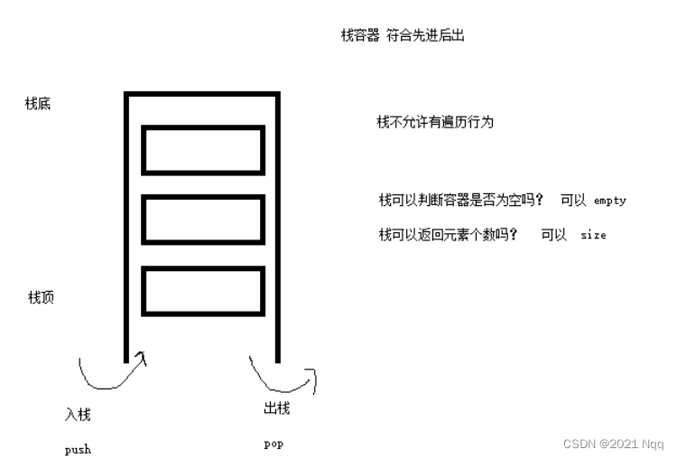

# stack容器

## 1. 基本概念

- stack是一种**先进后出**(First In Last Out,FILO)的数据结构，它只有一个出口。


- **栈中只有顶端的元素才可以被外界使用**，因此栈不允许有遍历行为
- 栈中进入数据称为 — **入栈** `push`
- 栈中弹出数据称为 — **出栈** `pop`



## 2. 常用接口

**构造函数：**

- `stack stk;` stack采用模板类实现， stack对象的默认构造形式
- `stack(const stack &stk);` 拷贝构造函数

**赋值操作：**

- `stack& operator=(const stack &stk);` 重载等号操作符

**数据存取：**

- `push(elem);` 向栈顶添加元素
- `pop();` 从栈顶移除第一个元素
- `top(); `返回栈顶元素

**大小操作：**

- `empty();` 判断堆栈是否为空
- `size(); `返回栈的大小

```cpp
# include <iostream>
using namespace std;
#include <stack>

// 栈

void test01()
{
    stack<int> s;

    // 入栈
    s.push(10);
    s.push(20);
    s.push(30);
    s.push(40);

    cout << "栈的大小" << s.size() << endl;

    // 出栈
    while(!s.empty()) // 如果栈不为空
    {
        // 查看栈顶元素
        cout << "栈顶元素" << s.top() << endl;
        s.pop();
    }

    cout << "栈的大小" << s.size() << endl;
}

int main(int argc, char *argv[])
{
   test01();
}

---------------------------------------------------------------
栈的大小4
栈顶元素40
栈顶元素30
栈顶元素20
栈顶元素10
栈的大小0
```

