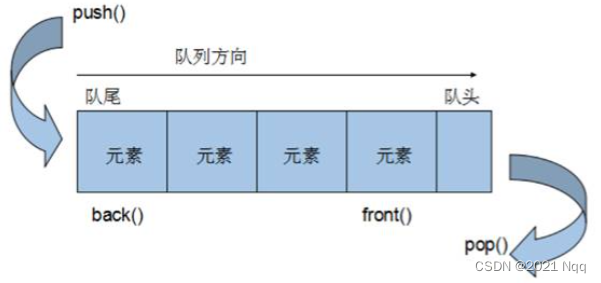

# queue容器

## 1. 概念

- 概念：Queue是一种**先进先出**(First In First Out,FIFO)的数据结构，它有两个出口。

  

- 队列容器**允许从一端新增元素，从另一端移除元素**。
- 队列中**只有队头和队尾才可以被外界使用，因此队列不允许有遍历行为**。
- 队列中进数据称为 — **入队** `push`
- 队列中出数据称为 — **出队** `pop`

## 2. 常用接口

**构造函数：**

- `queue que;` queue采用模板类实现，queue对象的默认构造形式
- `queue(const queue &que);` 拷贝构造函数

**赋值操作：**

- `queue& operator=(const queue &que);` 重载等号操作符

**数据存取：**

- `push(elem);` 往队尾添加元素
- `pop();` 从队头移除第一个元素
- `back();` 返回最后一个元素
- `front(); `返回第一个元素

**大小操作：**

- `empty();` 判断堆栈是否为空
- `size(); `返回栈的大小

```cpp
# include <iostream>
using namespace std;
#include <queue>

// 队列

class Person
{
    public:
    string m_name;
    int m_age;

    Person(string name, int age)
    {
        m_name = name;
        m_age = age;
    }
};

void test01()
{
    queue<Person> q;
    Person p1("唐僧", 30);
    Person p2("孙悟空", 1000);
    Person p3("猪八戒", 900);
    Person p4("沙僧", 800);

    // 入队
    q.push(p1);
    q.push(p2);
    q.push(p3);
    q.push(p4);

    // 队列大小
    cout << "队列大小" << q.size() << endl;

    while(!q.empty()) // 如果队列不为空
    {
        cout<< "队列头: " << q.front().m_name << endl;
        
        cout << "队尾: " << q.back().m_name << endl;

        q.pop(); // 出队列
    }

    cout << "队列大小" << q.size() << endl;

}

int main(int argc, char *argv[])
{
   test01();
}
```

