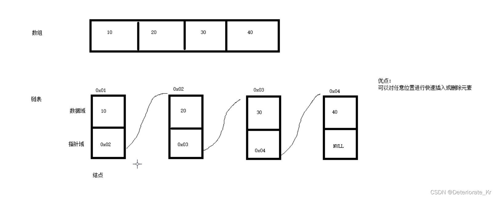
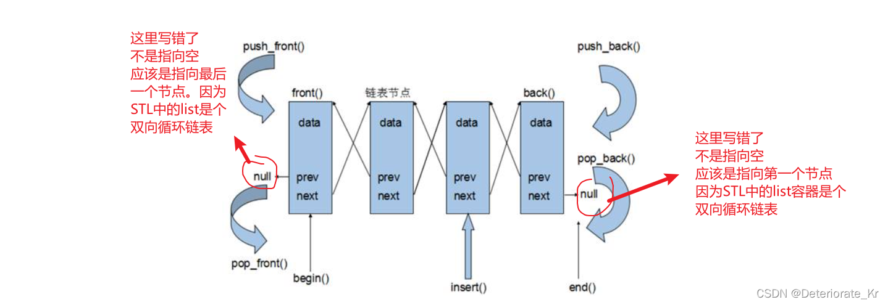

# List 容器

## 1. 基本概念

**功能**:将数据进行链式存储

**链表**（list）是一种物理存储单元上非连续的存储结构，数据元素的逻辑顺序是通过链表中的指针链接实现的

链表的组成：链表由一系列**结点**组成

结点的组成：一个是存储数据元素的**数据域**，另一个是存储下一个结点地址的**指针域**


链表和数组的区别：



数组的优点就是链表的缺点。链表的优点就是数组的缺点。

STL中的链表是一个双向循环链表

双向：节点的指针域里有两个指针。一个是前指针，指向前一个节点，第一个节点的前指针指向空。另一个是后指针，指向后一个节点，最后一个节点的后指针指向空

循环：第一个节点的前指针指向最后一个节点，最后一个节点的后指针指向第一个节点。



由于链表的存储方式并不是连续的内存空间，**因此链表list中的迭代器只支持前移和后移**，不支持跳跃式访问。属于双向迭代器。迭代器it一次性只能自增一次或自减一次；不能写成it+n，也不能写成it=it+n,包括it=it+1这么写也是错的

list的优点：

- 采用动态存储分配，不会造成内存浪费和溢出
  **也就是说链表的容量=链表里的节点数。有10000个数就有10000个节点，没有空位**。
- 链表执行插入和删除操作十分方便，修改指针即可，不需要移动大量元素

list的缺点：

- 链表灵活，但是空间(指针域) 和 时间（遍历）额外耗费较大

List有一个重要的性质，插入操作和删除操作都不会造成原有list迭代器的失效，这在vector是不成立的。

## 2. 构造函数

**函数原型：**

- `list lst;` //list采用采用模板类实现,对象的默认构造形式：
- `list(beg,end);` //构造函数将[beg, end)区间中的元素拷贝给本身。
- `list(n,elem);` //构造函数将n个elem拷贝给本身。
- `list(const list &lst);` //拷贝构造函数。

```cpp
#include<iostream>
using namespace std;
#include <list>
#include <algorithm> // 标准算法头文件

// list 容器
void printList(const list<int> &l1) // 
{
	for(list<int>::const_iterator it = l1.begin(); it != l1.end(); it++)
	{
		cout << *it << " ";
	}
	cout << endl;
}

void test01()
{
	list<int> l1; // 默认构造
	
	// 添加数据
	l1.push_back(10);
	l1.push_back(20);
	l1.push_back(30);
	l1.push_back(40);
	l1.push_back(50);

	// 遍历容器
	printList(l1);

	list<int> l2(l1.begin(), l1.end()); // 区间方式构造
	printList(l2);

	list<int> l3(l2); // 拷贝构造
	printList(l3);

	list<int>l4(10, 1000); // 10 个 1000
	printList(l4);
}

int main()
{
    test01();
}
```

## 3. 赋值和交换

**函数原型：**

- `assign(beg, end);` //将[beg, end)区间中的数据拷贝赋值给本身。
- `assign(n, elem);` //将n个elem拷贝赋值给本身。
- `list& operator=(const list &lst);` //重载等号操作符
- `swap(lst);` //将list与本身的元素互换。

```cpp
# include <iostream>
using namespace std;
#include <list>

// list列表
void printList(const list<int> &l1) // 
{
	for(list<int>::const_iterator it = l1.begin(); it != l1.end(); it++)
	{
		cout << *it << " ";
	}
	cout << endl;
}

void test01()
{
    list<int> l1;
    l1.push_back(10);
    l1.push_back(20);
    l1.push_back(30);
    l1.push_back(40);

    list<int> l2;
    l2 = l1;
    printList(l2);

    list<int> l3;
    l3.assign(l2.begin(), l2.end());
    printList(l3);

    list<int> l4;
    l4.assign(10, 100); // 10 个 100
    printList(l4);

    list<int> l5;
    l5.push_back(90);
    l5.push_back(80);
    l5.push_back(70);
    l5.push_back(60);

    cout << "-----------交换前-----------" << endl;
    printList(l1);
    printList(l5);
    cout << "-----------交换后-----------" << endl;
    l5.swap(l1);
    printList(l1);
    printList(l5);
}

int main(int argc, char *argv[])
{
   test01();
}
```

## 4. 大小操作

**函数原型：**

- `size(); `//返回容器中元素的个数
- `empty(); `//判断容器是否为空
- `resize(num);` //重新指定容器的长度为num，若容器变长，则以默认值0来填充新位置。如果容器变短，则末尾超出容器长度的元素被删除。
- `resize(num, elem); `//重新指定容器的长度为num，若容器变长，则以elem值填充新位置。如果容器变短，则末尾超出容器长度的元素被删除

```cpp
# include <iostream>
using namespace std;
#include <list>

// list列表
void printList(const list<int> &l1) // 
{
	for(list<int>::const_iterator it = l1.begin(); it != l1.end(); it++)
	{
		cout << *it << " ";
	}
	cout << endl;
}

void test01()
{
    list<int> l1;
    l1.push_back(10);
    l1.push_back(20);
    l1.push_back(30);
    l1.push_back(40);

    printList(l1);

    if(l1.empty())
    {
        cout << "容器为空" << endl;
    }
    else
    {
        cout << "容器不为空, 元素个数为:" << l1.size() << endl;
    }

    //l1.resize(10);
    // printList(l1); // 容器变长，则以默认值0来填充新位置, 10 20 30 40 0 0 0 0 0 0
    l1.resize(10, 100); // 或者不用默认的0， 手动指定填充元素 10 20 30 40 100 100 100 100 100 100
    printList(l1);

    l1.resize(2);
    printList(l1); // 容器变短，则末尾超出容器长度的元素被删除。10 20

}

int main(int argc, char *argv[])
{
   test01();
}
```

## 5. 插入和删除

**函数原型：**

注意插入函数中的pos得用迭代器，而且list容器的迭代器不支持跳跃式访问

- push_back(elem);//在容器尾部加入一个元素
- pop_back();//删除容器中最后一个元素
- push_front(elem);//在容器开头插入一个元素
- pop_front();//从容器开头移除第一个元素
- insert(pos,elem);//在pos位置插elem元素的拷贝，返回新数据的位置。
- insert(pos,n,elem);//在pos位置插入n个elem数据，无返回值。
- insert(pos,beg,end);//在pos位置插入[beg,end)区间的数据，无返回值。
- clear();//移除容器的所有数据
- erase(beg,end);//删除[beg,end)区间的数据，返回下一个数据的位置。
- erase(pos);//删除pos位置的数据，返回下一个数据的位置。
- remove(elem);//删除容器中所有与elem值匹配的元素。不需要提供迭代器

```cpp
# include <iostream>
using namespace std;
#include <list>

// list列表
void printList(const list<int> &l1) // 
{
	for(list<int>::const_iterator it = l1.begin(); it != l1.end(); it++)
	{
		cout << *it << " ";
	}
	cout << endl;
}

void test01()
{
    list<int> l1;
    l1.push_back(10); // 尾插
    l1.push_back(20);
    l1.push_back(30);
    l1.push_back(40);


    l1.push_front(100); // 头插
    l1.push_front(200);
    l1.push_front(300);
    l1.push_front(400);

    printList(l1); // 400 300 200 100 10 20 30 40

    l1.pop_back(); // 尾删
    printList(l1); // 400 300 200 100 10 20 30 

    l1.pop_front(); // 头删
    printList(l1); // 300 200 100 10 20 30

    // l1.insert(l1.begin(), 1000); // insert 插入， 第一个参数为迭代器
    // printList(l1); // 1000 300 200 100 10 20 30 

    list<int>::iterator it = l1.begin();
    ++it; // 迭代器偏移
    l1.insert(it, 2000);
    printList(l1); // 300 2000 200 100 10 20 30

    l1.erase(it);  // 按迭代器指向的位置删除
    printList(l1); // 300 2000 100 10 20 30

    l1.remove(2000); // 移除容器中所有指定的值
    printList(l1); // 300 100 10 20 30

    l1.clear(); // 清空
}

int main(int argc, char *argv[])
{
   test01();
}
```

## 6. 数据存取

**函数原型：**

- `front();` //返回第一个元素。
- `back();` //返回最后一个元素。

```cpp
#include<iostream>
using namespace std;
#include <list>
#include <algorithm> // 标准算法头文件

// list 容器
void printList(const list<int> &l1) // 
{
	for(list<int>::const_iterator it = l1.begin(); it != l1.end(); it++)
	{
		cout << *it << " ";
	}
	cout << endl;
}

void test01()
{
	list<int> l1;
    l1.push_back(10); 
    l1.push_back(20);
    l1.push_back(30);
    l1.push_back(40);

	// 不可以用 l1[] 或者 l1.at() 的方式访问list容器中的元素
	// 因为list本质是个链表

	cout << "第一个元素：" << l1.front() << endl;
	cout << "最后一个元素：" << l1.back() << endl;

	// 验证迭代器是不支持随机访问的
	list<int>::iterator it = l1.begin();
	it++; // 支持双向
	it--;
	// it=it+1; // 不支持随机访问

}

int main()
{
    test01();
}
```

## 7. 反转和排序

注意List不支持`#include <algorithm>`中的排序算法，因为List容器的迭代器不能跳跃式访问

list容器的公共接口里有排序函数

所有不支持随机访问迭代器的容器，不可以用标准算法

不支持随机访问迭代器的容器，内部会提供对应一些算法

**函数原型：**

- `reverse();` //反转链表
- `sort();` //链表排序，默认排序规则从小到大。升序

```cpp
#include<iostream>
using namespace std;
#include <list>
#include <algorithm> // 标准算法头文件

// list 容器
void printList(const list<int> &l1) // 
{
	for(list<int>::const_iterator it = l1.begin(); it != l1.end(); it++)
	{
		cout << *it << " ";
	}
	cout << endl;
}

// 如果要降序排
bool myCompare(int v1, int v2)
{
	return v1>v2;
}

void test01()
{
	list<int> l1;
    l1.push_back(20); 
    l1.push_back(10);
    l1.push_back(30);
    l1.push_back(40);

	l1.reverse(); // 反转

	printList(l1);

	// 排序
	// sort(l1.begin(), l1.end()); // 所有不支持随机访问迭代器的容器，不可以用标准算法， 内部分提供对应的一些成员函数的算法
	l1.sort();
	printList(l1); //  10 20 30 40 , 默认升序
	l1.sort(myCompare); // 降序排，降序排的算法自己实现
	printList(l1);
}

int main()
{
    test01();
}
```

## 8. 排序案例

```cpp
#include<iostream>
using namespace std;
#include <string>
#include <list>

//list容器 排序案例 对于自定义数据类型 做排序

//按照年龄进行升序，如果年龄相同按照身高进行降序

class Person
{
public:
	Person(string name,int age,int height)  //初始化三个属性
	{
		this->m_Name = name;
		this->m_Age = age;
		this->m_Height = height;
	}

	string m_Name; //姓名
	int m_Age;   //年龄
	int m_Height; // 身高
};


//指定排序规则
bool comparePerson(Person &p1,Person &p2)
{
	//按照年龄 升序
	if (p1.m_Age == p2.m_Age)
	{
		//年龄相同  按照身高降序
		return p1.m_Height > p2.m_Height;
	}
	else
	{
		return  p1.m_Age < p2.m_Age;
	}
	
}

void test01()
{
	list<Person>L; //创建容器

	//准备数据
	Person p1("刘备", 35, 175);
	Person p2("曹操", 45, 180);
	Person p3("孙权", 40, 170);
	Person p4("赵云", 25, 190);
	Person p5("张飞", 35, 160);
	Person p6("关羽", 35, 200);

	//插入数据
	L.push_back(p1);
	L.push_back(p2);
	L.push_back(p3);
	L.push_back(p4);
	L.push_back(p5);
	L.push_back(p6);

	for (list<Person>::iterator it = L.begin(); it != L.end(); it++)
	{
		cout << "姓名： " << (*it).m_Name << " 年龄： " << it->m_Age << " 身高： " << it->m_Height << endl;
	}

	//排序
	cout << "---------------------------------" << endl;
	cout << "排序后：" << endl;

	L.sort(comparePerson);  //自定义数据类型需要指定排序规则
	for (list<Person>::iterator it = L.begin(); it != L.end(); it++)
	{
		cout << "姓名： " << (*it).m_Name << " 年龄： " << it->m_Age << " 身高： " << it->m_Height << endl;
	}
}

int main() {

	test01();

	system("pause");

	return 0;
}
```

