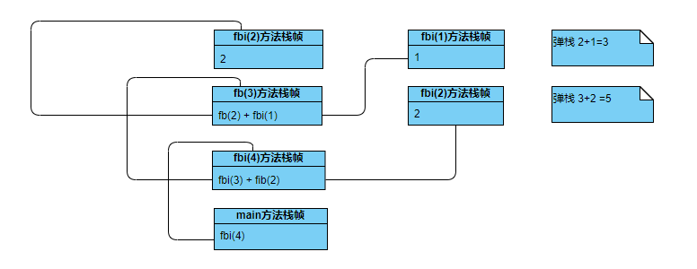

# java基础

https://www.pandidi.com/ youlin321/Youlin321

## 打印九九乘法表

```java
public class Test{
    public static void main(String[] args){
        for(int i = 1; i<=9; i++){
            for(int j=1; j<=i; j++){
                System.out.print( i + " * " + j + " = " + (i*j) + "\t");
            }
            System.out.println();
        }
    }
}
```

## 斐波那契数列

```java
// 斐波那契数列
// 1,1,2,3,5,8
public class Test{
    public static void main(String[] args){
        int result = Test.fbi(5);
        System.out.println(result);
    }
    
    public static int fbi(int i){
        if(i == 1 || i == 2){
            return i;
        }else{
            return fbi(i-1) + fbi(i-2);
        }
    }
}
```

递归方法栈图解



