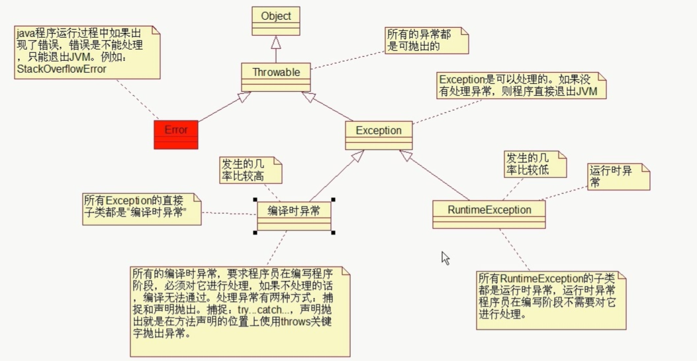

# 异常

## 异常的继承结构图



## throws

```java
/*
  异常：
  异常模拟的是现实世界中不正常的事件
  Java中采用类的形式模拟异常
  
  处理异常的两种方式：
    1. 在方法声明的位置上使用throws关键字向上抛出异常
*/

// 使用 throws 上抛异常
import java.io.*;
public class Test{
    
    
    public static void main(String[] args) throws FileNotFoundException{
        m1();
        
        // 使用throws处理异常并不是真正的处理异常，而是推卸责任
        // 谁调用的就会抛给谁
        // 因为采用的是上抛，JVM遇到这个异常就会退出JVM
        // 下面的输出不会打印
        System.out.println("使用throws处理异常并不是真正的处理异常，而是推卸责任");
    }
    
    public static void m1() throws FileNotFoundException{
        m2();
    }
    
    public static void m2() throws FileNotFoundException{
        m3();
    }
    
    public static void m3() throws FileNotFoundException{
        new FileInputStream("c:/ab.txt");  // FileInputStream构造方法声明位置上使用throws(向上抛)
    }
}
```

## try catch

```java
/*
  异常：
  异常模拟的是现实世界中不正常的事件
  Java中采用类的形式模拟异常
  
  处理异常的两种方式：
    1. 在方法声明的位置上使用throws关键字向上抛出异常
*/

// 使用 try catch 捕获异常
// catch 可以写多个，但是必须从小到大捕获异常。
// try catch 最多执行一个语句块。执行结束后，try catch 就结束了
import java.io.*;
public class Test{
    
    
    public static void main(String[] args) throws FileNotFoundException{
        try{
            FileInputStream fis = new FileInputStream("c:/abc.txt");
        }catch(FileNotFoundException e){
            System.out.println("捕获到文件异常");
            
            // 打印异常堆栈信息
            // e.printStackTrace();
            /*
            java.io.FileNotFoundException: c:\abc.txt (系统找不到指定的文件。)
                at java.io.FileInputStream.open0(Native Method)
                at java.io.FileInputStream.open(Unknown Source)
                at java.io.FileInputStream.<init>(Unknown Source)
                at java.io.FileInputStream.<init>(Unknown Source)
                at Test.main(Test.java:19)
            */
            
            String msg = e.getMessage(); // 用的不多
            System.out.println(msg); // c:\abc.txt (系统找不到指定的文件。)
            return;
            // 退出java虚拟机
            // System.exit(0);
            
        }catch(IOException e){
            System.out.println("IO流异常");
        }finally{
            // 只有在执行finally语句块之前执行System.exit(0)退出了JVM， 则finally语句块不会执行
            System.out.println("即使return也一定会执行的代码");
        }
    }
}
```

```java
/*
  finally 面试题
*/

public class Test{
    
    
    public static void main(String[] args) throws FileNotFoundException{
        int i = m1();
        System.out.println("main的i = " + i); // main的i = 10
    }
    
    public static int m1(){
        /*int i = 10;
        try{
            return i;
        }finally{
            i++;
            System.out.println("m1的i= " + i); // m1的i= 11
        }*/
        
        //以上代码的执行原理
        int i = 10;
        try{
            int tmp = i; // 
            return tmp;
        }finally{
            i++;
            System.out.println("m1的i= " + i); // m1的i= 11
        }
    }
}
```

## 自定义异常

```java
/*
  自定义异常
    1. 编译时异常 直接继承 Exception
    2. 运行时异常 直接继承 RuntimeException
*/

public class Test{
    
    public static void main(String[] args){
        String username = "jack";
        CustomerService cs = new CustomerService();
        try{
            cs.register(username);
        }catch(IllegalNameException e){
            System.out.println(e.getMessage());
        }
        
    }
    
    
}

// 编译时异常
class IllegalNameException extends Exception{
    
    // 定义异常一般提供两个构造方法
    public IllegalNameException(String msg){
        super(msg);
    }
}

class CustomerService{
    public void register(String name) throws IllegalNameException{
        if (name.length() < 6){
            // 创建异常对象
            //IllegalNameException e = new IllegalNameException("用户名长度不能少于6位");
            // 手动抛出异常
            // throw e;
            
            //可简写
            throw new IllegalNameException("用户名长度不能少于6位");
        }
        System.out.println("注册成功");
    }
}
```

