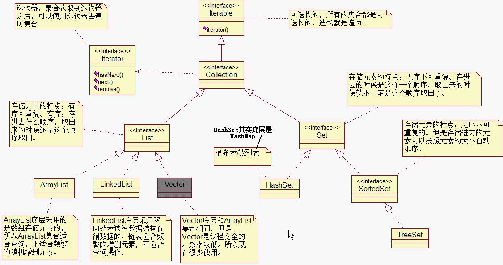
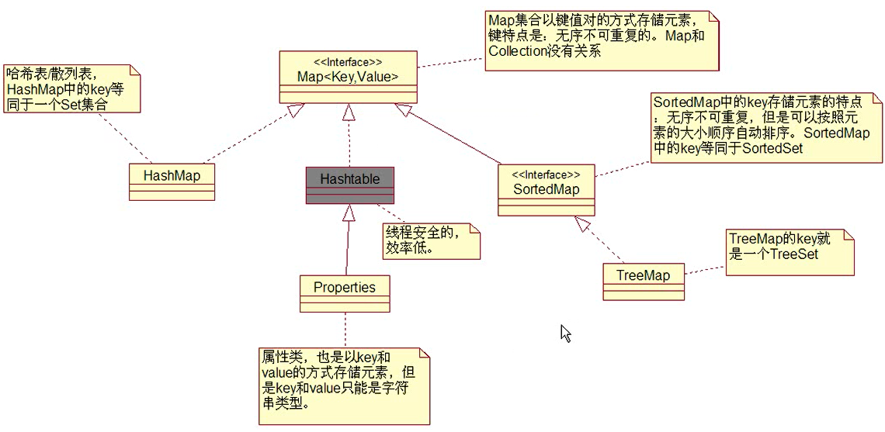

# 集合

## 集合继承结构图





## 集合迭代

```java
/*
    集合
*/

import java.util.*;
public class Test{
    
    public static void main(String[] args) throws Exception{
        // 创建集合对象
        Collection c = new LinkedList();
        c.add(100);
        c.add(3.14);
        c.add(false);
        
        Iterator it = c.iterator(); // c 集合
        
        while(it.hasNext()){
            Object element = it.next();
            System.out.println(element);
        }
        
    }
}
```

## 集合的常用方法

### contains

```
/*
    集合的常用方法
    存储在集合中的对象应该重写equals方法
*/

import java.util.*;
public class Test{
    
    public static void main(String[] args) throws Exception{
        Collection c = new ArrayList();
        
        // 创建两个Integer类型的对象
        Integer i1 = new Integer(10);
        
        // 添加元素
        c.add(i1);
        
        System.out.println(c.contains(i1)); // true 判断集合里是否包含对象
        
        Integer i2 = new Integer(10);
        
        // contains 方法底层调用的时equals方法，如果equals返回true， 就是包含
        // ArrayList 底层已重写了equals方法
        System.out.println(c.contains(i2)); // true
        
        Manager m1 = new Manager(1, "zhangsan");
        c.add(m1);
        System.out.println(c.contains(m1)); // true
        
        Manager m2 = new Manager(1, "zhangsan"); 
        
        // 重写equals方法之前 
        // System.out.println(c.contains(m2)); // false
        
        // 重写equals方法之后 
        System.out.println(c.contains(m2)); // true
        
    }
}


class Manager{
    int no;
    String name;
    
    Manager(int no, String name){
        this.no = no;
        this.name = name;
    }
    
    // 如果编号和姓名都相同，则表示同一个Manager
    public boolean equals(Object o){
        if(this == o){
            return true;
        }
        if(o instanceof Manager){
            Manager m = (Manager) o;
            if(m.no == this.no && m.name.equals(this.name)){
                return true;
            }
        }
        return false;
        
    }
}
```

### remove

```java
/*
    集合的常用方法
    存储在集合中的对象应该重写equals方法
*/

import java.util.*;
public class Test{
    
    public static void main(String[] args) throws Exception{
        Collection c = new ArrayList();
        
        // 创建两个Integer类型的对象
        Integer i1 = new Integer(10);
        
        // 添加元素
        c.add(i1);
        
        
        Integer i2 = new Integer(10);
        
        // 删除
        c.remove(i2);
        
        System.out.println(c.size()); // 0

    }
}
```

```java
/*
    迭代删除
*/

import java.util.*;
public class Test{
    
    public static void main(String[] args) throws Exception{
        Collection c = new ArrayList();
        
        c.add(1);
        c.add(2);
        c.add(3);
        c.add(4);
        
        Iterator it = c.iterator();
        
        while(it.hasNext()){
            it.next();
            it.remove();
        }
        
        System.out.println(c.size()); // 0
    }
}
```

## HashSet

```java
/*
    HashSet 集合
    
    HashSet 底层是HashMap
    
    HashSet 相当于 HashMap 中的key， 往HashMap中添加元素使用put方法， put{key, value} key是无序，不可重复。
    添加元素时会先调用key的hashCode方法， 如果hashCode没有重复的，则新增元素。
    
    以下代码中
    e1 和 e2 是new出来的两个对象，他们内存地址并不一样，e1和e2的hashCode值也不一样。
    因此需要重写hashCode方法。 如果 hashCode 返回的值一样就需要重写equals方法来判断
    
    存储在HashSet集合或者HashMap集合key部分的元素，需要同时重写hashCode() 和 equals() 方法。
*/

import java.util.*;
public class Test{
    
    public static void main(String[] args) throws Exception{
        // 创建集合
        Set es = new HashSet();
        
        // 创建对象
        Employee e1 = new Employee("zhangsan", "10"); 
        Employee e2 = new Employee("zhangsan", "10"); 
        Employee e3 = new Employee("lise", "20");
        Employee e4 = new Employee("wangwu", "30");
        Employee e5 = new Employee("zhaoliu", "40");
        Employee e6 = new Employee("chenqi", "50");
        
        System.out.println(e1.hashCode());
        System.out.println(e2.hashCode());
        
        // 添加元素
        es.add(e1);
        es.add(e2);
        es.add(e3);
        es.add(e4);
        es.add(e5);
        es.add(e6);

        System.out.println(es.size());
        
        
    }
}


class Employee{
    String name;
    String no;
    
    Employee(String name, String no){
        this.name = name;
        this.no = no;
    }
    
    // 重写equals 方法
    public boolean equals(Object o){
        if(this == o){
            return true;
        }
        if(o instanceof Employee){
            Employee e = (Employee)o;
            if(e.no == this.no && e.name == this.name){
                return true;
            }
        }
        return false;
    }
    
        
    // 重写hashCode方法
    public int hashCode(){
        // 以编号分组
        return no.hashCode(); // 均匀分布到不同的链表上
    }
    
}
```

## SortedSet

```java
/*
    SortedSet
    无序不可重复，但是存进去的元素可以按照元素大小自动排列
*/

import java.util.*;
import java.text.*;
public class Test{
    
    public static void main(String[] args) throws Exception{
        SortedSet ss = new TreeSet();
        
        // Integer 排序
        ss.add(10);
        ss.add(9);
        ss.add(2);
        ss.add(8);
        ss.add(7);
        ss.add(4);
        ss.add(6);
        
        Iterator it = ss.iterator();
        while(it.hasNext()){
            Object element = it.next();
            System.out.println(element);
        }
        
        SortedSet ts = new TreeSet();
        
        // 字符串排序
        ts.add("A");
        ts.add("a");
        ts.add("d");
        ts.add("e");
        ts.add("f");
        ts.add("c");
        
        it = ts.iterator();
        while(it.hasNext()){
            Object element = it.next();
            System.out.println(element);
        }
        
        // 日期排序
        String str_date1 = "2021-07-22";
        String str_date2 = "2021-06-02";
        String str_date3 = "2021-07-21";
        String str_date4 = "2021-07-22";
        String str_date5 = "2021-07-30";
        String str_date6 = "2021-07-01";
        
        SimpleDateFormat sdf = new SimpleDateFormat("yyyy-MM-dd");
        Date t1 = sdf.parse(str_date1);
        Date t2 = sdf.parse(str_date2);
        Date t3 = sdf.parse(str_date3);
        Date t4 = sdf.parse(str_date4);
        Date t5 = sdf.parse(str_date5);
        Date t6 = sdf.parse(str_date6);
        
        SortedSet ds = new TreeSet();
        ds.add(t1);
        ds.add(t2);
        ds.add(t3);
        ds.add(t4);
        ds.add(t5);
        ds.add(t6);

        it = ds.iterator();
        while(it.hasNext()){
            Object element = it.next();
            if(element instanceof Date){
                System.out.println(sdf.format(element));
            }
        }
    }
}
```

```java
/*
    重写 Comparable 
    被比较的元素需要实现Compareable接口
*/

import java.util.*;
public class Test{
    
    public static void main(String[] args) throws Exception{
        SortedSet ss = new TreeSet();
        User u1 = new User(10);
        User u2 = new User(50);
        User u3 = new User(40);
        User u4 = new User(10);
        User u5 = new User(30);
        
        ss.add(u1);
        ss.add(u2);
        ss.add(u3);
        ss.add(u4);
        ss.add(u5);
        
        Iterator it = ss.iterator();
        while(it.hasNext()){
            Object element = it.next();
            System.out.println(element);
        }
    }
}

// 实现 java.lang.Comparable 接口中的 compareTo 方法
class User implements Comparable{
    int age;
    
    User(int age){
        this.age = age;
    }
    
    // 该方法由程序员负责实现， SUN提供的程序已经调用了该方法
    public int compareTo(Object o){
        int age1 = this.age;
        int age2 = ((User)o).age;
        return age1 - age2;
    }
    
    public String toString(){
        return "[User age : " + age + "]";
    }
}
```

## Comparator

```java
/*
    Comparator
*/

import java.util.*;
public class Test{
    
    public static void main(String[] args) throws Exception{
        // 创建TreeSet集合的时候提供一个比较器
        // SortedSet products = new TreeSet(new ProductComparator());
        
        // 使用匿名内部类的方式
        SortedSet products = new TreeSet(new Comparator(){
            // 按商品价格排序
            public int compare(Object o1, Object o2){
                double price1 = ((Product)o1).price;
                double price2 = ((Product)o2).price;
                if(price1 == price2){
                    return 0;
                }else if(price1>price2){
                    return 1;
                }else{
                    return -1;
                }
            }
        });
        
        Product p1 = new Product(3.1);
        Product p2 = new Product(2.1);
        Product p3 = new Product(3.1);
        Product p4 = new Product(3.5);
        Product p5 = new Product(4.1);
        Product p6 = new Product(4.4);
        
        products.add(p1);
        products.add(p2);
        products.add(p3);
        products.add(p4);
        products.add(p5);
        products.add(p6);
        
        Iterator it = products.iterator();
        while(it.hasNext()){
            System.out.println(it.next());
        }
    }
}

class Product{
    double price;
    
    Product(double price){
        this.price = price;
    }
    
    public String toString(){
        return price + "";
    }
}

// 单独编写一个比较器
class ProductComparator implements Comparator{
    
    // 按商品价格排序
    public int compare(Object o1, Object o2){
        double price1 = ((Product)o1).price;
        double price2 = ((Product)o2).price;
        if(price1 == price2){
            return 0;
        }else if(price1>price2){
            return 1;
        }else{
            return -1;
        }
    }
}
```

## Properties

```java
/*
    Properties
    Properties 也是由key和value组成，但是key和value都是字符串类型, key不能重复
*/

import java.util.*;
public class Test{
    
    public static void main(String[] args) throws Exception{
        // 创建属性类对象
        Properties p = new Properties();
        
        p.setProperty("user", "stanlong");
        p.setProperty("password", "123456");
        p.setProperty("driver", "mysql.jdbc");
        p.setProperty("port", "3306");
        
        System.out.println(p);
        
        // 通过key获取value
        String user = p.getProperty("user");
        String password = p.getProperty("password");
        String driver = p.getProperty("driver");
        String port = p.getProperty("port");
        
        System.out.println(user + " , " + password + " , " + driver + " , " + port);
        
    }
}
```

## 泛型

```java
/*
    自定义泛型
    泛型就是编译期检查
*/

import java.util.*;
public class Test{
    
    public static void main(String[] args) throws Exception{
        MyClass<String> mc = new MyClass<String>();
        
        // mc.m1(100); 报错 不兼容的类型: int无法转换为String
        
        mc.m1("StanLong");
        
    }
}

// 自定义泛型
class MyClass<T> {
    public void m1(T t){
        System.out.println(t);
    }
}
```

## 增强for循环

```java
/*
    增强for循环
    语法
    for(类型 变量 : 数组名/集合名){}
    缺点：没有下标
*/

import java.util.*;
public class Test{
    
    public static void main(String[] args) throws Exception{
        
        List<String> list = new ArrayList<String>();
        list.add("1");
        list.add("2");
        list.add("3");
        list.add("4");
        list.add("5");
        
        for(String i : list){
            System.out.println(i);
        }
    }
}
```


