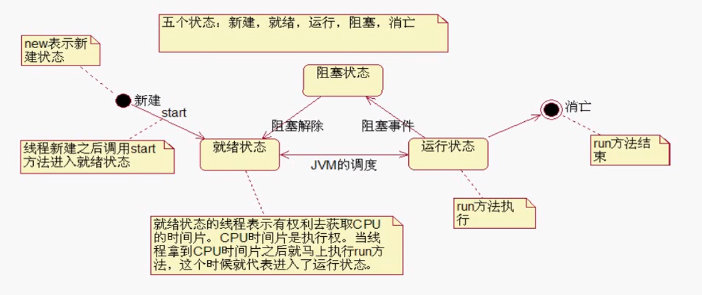

# 多线程

## 实现线程的方式一

```java
/*
    线程
    有了多线程后，main方法结束后只是主线程中没有方法栈帧了。
    但是其他线程或者其他栈中还有栈帧
    main方法结束，程序可能还在运行
*/

import java.io.*;
public class Test{
    
    public static void main(String[] args) throws Exception{
        
        // 创建线程
        Thread t = new Processor();
        
        // t.run(); 这样写只是普通方法调用，程序只有一个线程，run方法结束后，下面的程序才能继续执行
        
        // 启动
        t.start(); // 这段代码执行瞬间结束，告诉JVM再分配一个新的栈给t，run 方法在系统线程启动之后会自动调用。
        
        for(int i=0; i<10; i++){
            System.out.println("mian-->" + i);
        }
    }
    
}

class Processor extends Thread{ // 实现线程的方式一继承 Thread
    
    // 重写run方法
    public void run(){
        for(int i=0; i<100; i++){
            System.out.println("run-->" + i);
        }
    }
}
```

## 实现线程的方式二

```java
/*
    线程
    有了多线程后，main方法结束后只是主线程中没有方法栈帧了。
    但是其他线程或者其他栈中还有栈帧
    main方法结束，程序可能还在运行
*/

import java.io.*;
public class Test{
    
    public static void main(String[] args) throws Exception{
        
        // 创建线程
        Thread t = new Thread(new Processor());
        
        // t.run(); 这样写只是普通方法调用，程序只有一个线程，run方法结束后，下面的程序才能继续执行
        
        // 启动
        t.start(); // 这段代码执行瞬间结束，告诉JVM再分配一个新的栈给t，run 方法在系统线程启动之后会自动调用。
        
        for(int i=0; i<10; i++){
            System.out.println("mian-->" + i);
        }
    }
    
}

class Processor implements Runnable{ // 实现 Runnable 接口，推荐用这种方式
    
    // 重写run方法
    public void run(){
        for(int i=0; i<100; i++){
            System.out.println("run-->" + i);
        }
    }
}
```

## 线程的生命周期



新建：采用 new 语句创建完成

就绪：执行 start 后

运行：占用 CPU 时间

阻塞：执行了 wait 语句、执行了sleep语句和等待某个对象锁，等待输入的场合

终止：退出 run() 方法